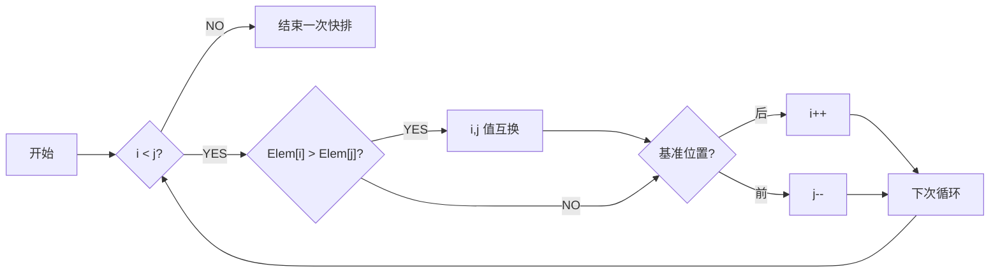

# 数据结构（2）

## 图

### 基本概念

数据结构中的图：不带自身环，关联边不能多于一条

$
graph=(V,E)
$

顶点 vertex

有向边又称为弧，有弧尾（始点）和弧头（终点）

### 存储结构

思考：如何找到环？

#### 邻接矩阵

##### 概念


用一维数组 `vertexes[]` 存储顶点信息，二维数组 `arcs[]` 存储边信息


##### 无向图的邻接矩阵


###### 类模板定义

```c++
//图的邻接矩阵类
template <class ElemType, class WeightType>
class AdjMatrixGraph
{
protected:
    int _vexMaxNum, _arcNum;     // 最大顶点数, 边数
    int *_tag;                   // 标志数组
    SeqList<ElemType> _vertexes; // 顶点数组
    int **_arcs;                 // 邻接矩阵, 二维数组
    int _dirType;                // 有向图或无向图
    int _weightType;             // 带权值或不带权值
    WeightType _infinity;

public:
    AdjMatrixGraph(int dirType = 0, int weightType = 0,
                   int vexMaxNum = DEFAULT_SIZE, WeightType infinity = DEFAULT_INFINITY); //默认构造函数
    AdjMatrixGraph(ElemType *es, int vexNum,
                   int dirType = 0, int weightType = 0,
                   int vexMaxNum = DEFAULT_SIZE, WeightType infinity = DEFAULT_INFINITY); //构造函数
    ~AdjMatrixGraph();
    void Clear();
    bool IsEmpty();
    int GetVexNum() const;                          // 求顶点个数
    int GetArcNum() const;                          // 求边数
    int GetOrder(ElemType vex) const;               // 求顶点序号
    ElemType GetElem(int index) const;              // 求指定下标的顶点值
    void SetElem(int index, ElemType vex);          // 更新指定下标的顶点值
    int GetFirstAdjVex(int v) const;                // 求v的第一个邻接点的下标
    int GetNextAdjVex(int v1, int v2) const;        // 求v1相对于v2的下一个邻接点的下标
    void InsertVex(const ElemType &vex);            // 插入顶点
    void InsertArc(int v1, int v2, int weight = 1); // 插入边
    void DeleteVex(const ElemType &vex);            // 删除顶点
    void DeleteArc(int v1, int v2);                 // 删除边
    WeightType GetWeight(int v1, int v2) const;     // 求从顶点为v1到v2的边的权值
    void SetWeight(int v1, int v2, WeightType w);   // 设置从顶点为v1到v2的边的权值
    int GetTag(int v) const;                        // 求顶点v的标志值
    void SetTag(int v, int value);                  // 设置顶点v的标志值
    void Display() const;                           // 打印图
    void SetArcs(int **arcs, int vexNum);           // 设置新的邻接矩阵
    void Dijkstra(int v);                           // 迪杰斯特拉算法
    int GetInDegree(int v) const;                   // 求v的入度
    void TopSort() const;                           // 有向无权图的拓扑排序
    void CriticalPath() const;                      // AOE网络的开始时间、关键路径
    bool IsConnected();                             // 判断图是否连通
    void DFS(int v);                                // 深度优先搜索
    void DFSHelp(int v);                            // 深度优先遍历, 无输出
    void DFSTraverse();                             // 深度优先遍历
    void TearCycle();                               // 破圈法, 求带权连通无向图的最小生成树
};
```

#### 邻接表

把邻接矩阵的每一行记为一个单链表，把竖着排列的边连接成为一个边链表

记录有向图的出度，使用**逆邻接表**


#### 邻接多重表

(Adjacency Multilist)

用来存储无向图

邻接多重表中，每条边用一个结点表示，每个顶点也用一个结点表示


- data：存储此顶点的数据；
- firstedge：指针域，用于指向同该顶点有直接关联的存储其他顶点的节点


- mark：标志域，用于标记此节点是否被操作过，例如在对图中顶点做遍历操作时，为了防止多次操作同一节点，mark 域为 0 表示还未被遍历；mark 为 1 表示该节点已被遍历；
- ivex 和 jvex：数据域，分别存储图中各边两端的顶点所在数组中的位置下标；
- ilink：指针域，指向下一个存储与 ivex 有直接关联顶点的节点；
- jlink：指针域，指向下一个存储与 jvex 有直接关联顶点的节点；
- info：指针域，用于存储与该顶点有关的其他信息，比如无向网中各边的权


#### 十字链表

（Orthogonal List）

用来存储有向图

十字链表（即有向图的邻接多重表）可以看作是邻接表和逆邻接表的合体


### 遍历

思考：深度、广度分别有什么应用？

#### 深度优先遍历 DFS

（Depth First Search, DFS）

理论上，结果不唯一

##### 步骤

1. 访问节点 v，并标记其已访问
2. 取 v 的第一个邻接顶点 w
3. 判断
   1. w 是存在
      1. 若是，继续
      2. 若否，返回
   2. w 是否被访问
      1. 若是，取 v 的下下个邻接顶点，转到步骤 3
      2. 若否，访问 w，标记，转到步骤 1


##### 时间复杂度

- 邻接表：O(n+e)
- 邻接矩阵：O(n^2^)

##### 实现

#### 广度优先遍历 BFS

（Breadth First Search, BFS）

##### 步骤

1. 访问节点 v，并标记其已访问，使 v 入队
2. 队空时，返回；若队非空，继续
3. 出队 v
4. 取 v 的第一个邻接顶点 w
5. 判断 w 是否存在
   1. 若存在，继续
   2. 若不存在，转步骤 3
6. 判断 w 是否被访问
   1. 若被访问，继续
   2. 若未被访问，访问 w 并标记，使 w 入队，继续
7. 取 v 的下下个邻接顶点覆盖 w，转步骤 5


##### 时间复杂度

- 邻接表：O(n+e)
- 邻接矩阵：O(n^2^)

#### 连通分量

遍历算法的应用

定义：非连通图中的极大连通子图

### 最小生成树

#### 概念

##### 生成树

- 定义：连通图的极小连通子图
- 特点
  - 任意两顶点有且只有一条路径
  - n 个顶点的生成树具有 n-1 条边
  - 生成树不唯一，n 个顶点的完全图有 $n^{n-2}$ 种生成树
  - 不同遍历方法 / 不同顶点出发 / 不同存储结构，生成树不同
  - n 个顶点 n-1 条边也不一定是生成树

##### 最小生成树

（minimum cost spanning tree, MST）

- 定义：连通网中，权值总和最小的生成树，全称最小代价生成树


- 性质：假设 N = (V, E) 是一个连通网，U 是顶点集 V 的一个非空子集。若 (u, v) 是一条具有最小权值的边，其中 u∈U， v∈V - U，则必存在一棵包含边（u，v）的最小生成树

#### 克鲁斯卡尔算法

(Kruskal)

##### 步骤


设 G = (V, E) 是具有 n 个顶点的连通网，T = (U，TE) 是其最小生成树。

1. 选取权值最小的边（V~i~，V~j~），若边（V~i~，V~j~）加入到 TE 后形成回路 (环)，则舍弃该边，否则将该边加入到 TE 中。
2. 重复 1，知道 TE 中含有 n-1 条边为止


##### 实现

用最小堆来找最小边

用并查集来判断有无环

#### 普利姆算法

(Prim)

基于 MST 性质、

##### 步骤


### 最短路径

（Shortest Path）

#### 类别

- 单源点最短路径

  给定网 G 和 V，求 V 到其他顶点的最短路径

- 多源点最短路径

  给定网 G，求其中顶点到其他各顶点的最短路径

#### 弧上权值非负的单源点最短路径


##### 迪杰斯特拉算法（Dijkstra）

按路径长度递增的次序来产生最短路径；先求路径最短的一条，然后参照它进行刷新，求出长度次短的一条，以此类推，被求出长度的顶点放入集合 S 中，当 S 满，代表算法结束


引入 dist[]，存储 v 到 v~i~ **当前**找到的最短路径长度；引入 path[]，存储 v~i~ 的直接前驱节点


只看初边

##### 实现

```cpp
template <class ElemType, class WeightType>
void AdjMatrixGraph<ElemType, WeightType>::Dijkstra(int v)
// 求索引为v的顶点的各个最短路径长度
{
    int _vexNum = _vertexes.GetLength();
    WeightType min;
    WeightType dist[_vexNum]; // 存储当前找到的最短路径长度
    int path[_vexNum];        // 存储目标顶点的直接前驱节点

    for (int i = 0; i < _vexNum; i++)
    {
        dist[i] = _arcs[v][i]; // 存入一条边的路径
        SetTag(i, 0);          // 用_tag表示已经找到最短路径的集合
        if (i != v && dist[i] < _infinity)
            // 若dist[i]存在, 添加前驱节点
            path[i] = v;
        else
            path[i] = -1;
    }
    SetTag(v, 1); //自身已经在集合中

    cout << "所选源点: " << GetElem(v) << endl;

    int finalVex; // 已求出最短路径的顶点
    int w;
    for (int i = 1; i < _vexNum; i++)
    // 按递增序列求最短路径
    {
        min = _infinity;
        finalVex = v;
        for (int j = 0; j < _vexNum; j++)
        // 查询最小的最短路径, 找出finalVex
        {
            if (_tag[j] == 0 && dist[j] < min)
            {
                finalVex = j;
                min = dist[j];
            }
        }
        SetTag(finalVex, 1);
        for (int j = GetFirstAdjVex(finalVex); j != -1; j = GetNextAdjVex(finalVex, j))
        // 从上一次找到的最短路径的顶点出发, 依次判断各顶点的最短路径能否更新
        {
            if (_tag[j] == 0 && min + GetWeight(finalVex, j) < dist[j])
            {
                dist[j] = min + GetWeight(finalVex, j);
                path[j] = finalVex;
            }
        }
    }
    // 打印输出
    for (int i = 0; i < _vexNum; i++)
    {
        if (i == v)
            continue;
        string pathStr(1, GetElem(i));

        for (int j = path[i]; j != -1; j = path[j])
        {
            pathStr = string(1, GetElem(j)) + " -> " + pathStr;
        }
        cout << "从顶点 " << GetElem(v) << " 到顶点 " << GetElem(i) << " 的最短路径为: " << pathStr
             << ", 长度为: " << dist[i] << endl;
    }
}
```

#### 弧上权值任意值的单源点最短路径

##### 贝尔曼 - 福特算法

从原点依次经过其他顶点，来缩短到达顶点的最短路径长度。要求：途中不能有路径长度为负数的**回路**


递推公式


#### 所有点之间的最短路径

##### 重复迪杰斯特拉

以每一个点为原点，重复执行迪杰斯特拉算法；O(n^3^)

##### 弗洛伊德（Floyd）算法


### 活动网络

（Activity Network）

#### 用顶点表示活动的网络


##### 概念

- 有向无环图（Directed acycline graph）：一个无环的有向图，简称 DAG 图
- 顶点表示活动的网络（Activity on vertices）：AOV 网络
- 拓扑排序：把 AOV 网络中各顶点按照他们相互之间的优先关系排列成一个线性序列的过程
  - 在有向图中选一个没有前驱的顶点且输出之
  - 从图中删除该顶点和所有以它为尾的弧
  - 重复前两步，直到所有顶点均已输出


#### 用边表示活动的网络


##### 概念

- 边表示活动的网络（activity on edges）：简称 **AOE 网络**
  - 边的值：此活动持续的时间


- 顶点表示事件（event），保证一个源点，一个汇点
  - 关键路径：从源点到汇点，具有最大路径长度的路径
  - 关键活动：关键路径上的所有活动


- 求事件（顶点）的最早开始时间 ve：从源点起，入边的值加上其弧尾的最早开始时间，取最大值（看入边，求最大）
- 求事件（顶点）的最晚开始时间 vl：从汇点起，弧头的最早开始时间减去出边的值，取最小值（看出边，求最小）
- 求活动（边）的最早开始时间 ee：弧尾的最早开始时间
- 求活动（边）的最晚开始时间 el：其弧头的最晚开始时间减去活动时间

## 查找

### 基本概念

- 数据表：数据的有限集合
- 关键字：字段、属性域；互不相同的关键字也成为主关键字
- 查找表：支持查找功能的数据表
  - 静态查找表：表中元素固定不变
  - 动态查找表：表中元素在插入和删除时会得到调整，当查找失败时，将给定值的数据元素插入数据表中
- 装载因子 / 装填因子：数据表的长度 m 与数据元素个数 n 的比值，$\alpha=n/m$
- 平均查找长度 ASL (Average Search Length)：n 个关键字，第 i 个元素被查找的概率 P~i~，查找第 i 个元素所需进行关键字的比较次数为 C~i~

$
ASL=\sum_{i=1}^nP_i\times C_i
$

### 顺序表

#### 顺序查找

一个一个去找

##### 一般实现

```C++
template <class T>
int SqSearch(T elem[], int n, T key)
{

    for (int i = 0; i < n && elem[i] != key; i++)
        ;
    if (i < n)
        return i;
    else
        return -1;
}
```

##### 监视哨实现

0 号元素不存内容时，while 中的索引 0 可以起到**监视哨**的作用

```c++
template <class T>
int SqSearch(T elem[], int n, T key)
{
    elem[0] = key;
    int i = n;
    while (elem[i] != key)
        i--;
    return i;
}
```

##### 性能分析

$
ASL=\sum_{i=1}^n\frac{1}{n}\times i=\frac{n-1}{2}
$

优点：算法简单，适应面广，对表的结构或关键字是否有序没有要求

缺点：查找效率低

#### 二分查找

（Binary Search）

按顺序方式存储 + 关键字排序


##### 迭代实现

##### 递归实现

##### 性能分析

用二叉查找树来分析


$
ASL=\log_2(n+1)-1
$
优点：特别当 n 大时，效率高

缺点：只限于顺序存储结构，只适合做静态查找

#### 分块查找

##### 索引顺序表

主表 + 索引表


当完全索引表中的关键字分块有序存放，可以建立二级索引表

块与块之间有序，块内无序


##### 分块查找

分两次查找

#### 倒排表

（Inverted Index List）

经常搜索的关键字设次索引

##### 链式倒排表


寻找时，求交集即可

表长不定，管理麻烦

##### 单元素倒排表


#### 比较

| 要求     | 顺序查找         | 折半查找 | 分块查找           |
| -------- | ---------------- | -------- | ------------------ |
| ASL      | 最大             | 最小     | 两者之间           |
| 表结构   | 有序表、无序表   | 有序表   | 分块有序表         |
| 存储结构 | 顺序存储、线性表 | 顺序存储 | 顺序存储、线性链表 |

### 二叉排序树

BST（Binary Sort / Search Tree）

对于链式存储，使用二叉排序树（二叉搜索树），以适应动态查找的要求

#### 定义

- 要不是空树，要不符合以下性质
  - 左子树节点关键字都小于根节点
  - 右子树节点关键字都大于根节点
  - 左右子树也是二叉排序树

特点：中序遍历结果有序


#### 模板定义

```c++
template <class T>
class BinSortTree : public BinaryTree<T>
{
    // 继承二叉树的根节点数据成员
public:
    BinSortTree(T refvalue) : BinaryTree<T>(refvalue){};
    BinSortTree(T *a, int n); // 插入数组元素构建二叉排序树, 不用判断
    ~BinSortTree() {}
    void Insert(const T &x, BinTreeNode<T> *&p); // 以p为根节点, 按大小插入元素
    /*判定是否为二叉排序树*/
    bool IsBST_Recursive(BinTreeNode<T> *r, T *pre, bool *result); // 递归方式判断是否为二叉排序树
    bool IsBST_Recursive();
    void DisplayLarger(BinTreeNode<T> *p, const T &x); // 从大到小输出不小于x的元素
    void DisplayLarger(const T &x)
    {
        DisplayLarger(this->_root, x);
        cout << endl;
    }
    bool Find_NoRecursive(BinTreeNode<T> *&root, const T &x); // 在以root为根的子树中查找x
    bool Find_NoRecursive(const T &x) { return Find_NoRecursive(this->_root, x); }
    void Insert_NoRecursive(BinTreeNode<T> *&root, const T &x); // 在以root为根的子树中插入x
    void Insert_NoRecursive(const T &x) { Insert_NoRecursive(this->_root, x); }
    bool SearchOrInsert(T &x);
};
```

#### 查找

- 步骤
  1. 从根开始将 x 与节点值进行比较
  2. 若 x 小，沿着左子树搜索
  3. 若 x 大，沿着右子树搜索
  4. 若与 x 相等，查找成功；若为空则查找失败

比较次数不大于 ` h + 1`

#### 性能分析


#### 操作

##### 插入

先搜索 BST 中有无该节点，无才插入

查找失败时插入

##### 删除

被删节点为叶子，将双亲结点的相应指针置空

被删节点无右子树，拿左孩子顶替它的位置

被删节点无左子树，拿右孩子顶替它的位置

被删节点左右子树都有

1. 左子树找最大
2. 或者右子树找最小

### 平衡二叉树

AVL

#### 定义

- 或是空树，或是符合以下条件的二叉排序树
- 左右子树都是平衡二叉树。
- 左右子树的高度差值不超过 1
- 平衡因子（Balance factor，BF）：左右子树高度差，其绝对值不超过 1
- 其 ASL 可保持在 $O(log_2n)$


#### 平衡旋转

##### LL 平衡旋转——右单旋转

左孩子的左子树失衡

顺时针旋转


##### RR 平衡旋转——左单旋转

右孩子的右子树失衡

逆时针旋转


##### LR 平衡旋转——先左后右双旋转

先逆时针再顺时针

左孩子的右子树失衡


##### RL 平衡旋转——先右后左双旋转

右孩子的左子树失衡


#### 插入

##### 思想

1. 按二叉树的排序性质插入节点
2. 若插入后产生失衡，继续步骤 3，否则结束
3. 找到失衡的最小子树
4. 判断平衡旋转类型，进行相应的平衡化处理


##### 示例


#### 删除

##### 思想

定义布尔变量 `isShorter` 判断被删除结点的子树高度有没有被缩短


##### 示例

删除结点 50


### B- 树

二叉排序树适合在内存中组织较小的索引；若对于存放在外存中的较大的文件系统，使用 B- 树或 B+ 树做文件索引

#### 动态的 m 路查找树

**定义**

- 或是空树，或满足以下条件
- 根节点最多有 m 棵树并具有结构 $(n,p_0,k_1,p_1,k_2,p_2,\cdots,k_n,p_n)$。其中，$p_i$ 是指向子树的指针，$k_i$ 是数据元素的关键字；$1\le i\le n<m$
- $k_i<k_{i+1},i\le i<n$
- 在 $p_i$ 所指的子树中所有数据元素的关键字都大于 $k_i$，且小于 $k_{i+1}$，$0\le i\le n$
- 在 $p_n$ 所指的子树中所有数据元素的关键字都大于 $k_n$，而子树 $p_0$ 中的所有数据元素的关键字均小于 $k_1$
- $p_i$ 所指的子树也是 m 路查找树，$0\le i\le n$


#### 定义

一颗 m 阶的 B- 树是一种平衡的 m 路查找树，通常用于文件系统（外查找）

失败节点即叶子节点


#### 插入

##### 思路

插入指在结点中插入关键字

关键字数在 $[\lceil m/2 \rceil-1,m-1]$ 之间

若关键字超出 m-1，结点要分裂


插入是个递归的过程

##### 示例

按照关键字 {35，26，74，60，49，17，41，53，29} 构建 3 阶 B- 树


#### 删除


#### B+ 树

##### 定义

叶子结点包含了全部关键字及对应指针


### 散列表

基本思想：在存储地址和关键字之间构建一个确定的对应关系。不经过比较就能在一次存取中得到所查元素

#### 定义

- 哈希函数：在存储地址和关键字之间构建一个确定的对应关系/函数 $Addr(ai)=H(ki)$
- 哈希表/散列表
- 哈希存储/散列存储
- 哈希查找/散列查找
- 冲突 (collision)：$key1\neq key2,H(key1)=H(key2)$

#### 哈希函数

定义域：全部关键字

值域：0 到 m-1 之间

##### 构造方法

不是重点

- 直接定址法

  $H(key)=a*key+b$，无冲突，但是要求散列地址空间大小与关键字集合大小相同

- 数字分析法

- 除留余数法

- 随机数法

#### 处理冲突

##### 开放地址法

当冲突发生时，形成一个探查序列，逐个探查，直到找出一个空位置

**探查序列**

1. 线性探测再散列
   - d~i~=1,2,3,...,m-1
2. 二次探测再散列
   - d~i~=1^2^,-1^2^,2^2^,-2^2^,...,k^2^,-k^2^
3. 伪随机探测再散列
   - d~i~=伪随机序列
4. 双散列函数探查法
   - d~i~=iH~2~(key)[计算时间增加]


##### 拉链法

将所有关键字为同义词的记录存储在一个单链表中，并用一维数组存放头指针


#### 哈希查找

##### 过程


##### 分析

用 ASL 分析效率

装填因子：$\alpha=\frac{表中填入的记录数}{哈希表长度}$


## 排序

原理和算法实现不一定对应


### 基础知识

- 排序（sorting）
- 关键字（key）：分主次关键字
- 排序表
- 排序的稳定性：两个相同值的关键字的相对位置在排序后是否发生变化
- 内部排序：待排的数据在内存上
- 排序的基本操作：比较次数、移动次数
- 趟：对所有数据进行一次操作

#### 分组

- 按排序依据原则分组
  - 插入排序
  - 交换排序
  - 选择排序
  - 归并排序
  - 基数排序（分配排序）
- 按排序所需工作量分组
  - 简单的排序方法：$T(n)=O(n^2)$
  - 先进的排序方法：$T(n)=O(log_n)$
  - 基数排序：$T(n)=O(d.n)$

#### 排序的存储方式

顺序表、链表、类静态链表

#### 各种排序方法的选用

- 时间复杂度
- 空间复杂度
- 稳定性
- 算法结构鲁棒性
- 参加排序数据的规模
  - 较少，采用简单的排序方法
    - 直接插入排序，选择排序
  - 较大，选用执行时间与 $nlog_2n$ 成正比的排序方法
    - 快速排序，希尔排序，堆排序，归并排序
  - 较大，且关键字位数少
    - 基数排序
- 关键字的分布情况
  - 分布平均、随机
    - 快速排序（时间短）、堆排序（空间少），希尔排序（也可）
  - 分组基本有序
    - 冒泡排序、直接插入排序

### 交换排序

（Exchange Sort）

对两个数据比较，如果逆序，则两者交换位置

#### 冒泡排序

两两相比，重复，每次循环只确定一个最大/小值


##### 实现

顺序表实现

```c++
template <class T>
SeqList<T> BubbleSort(SeqList<T> list)
{
    for (int i = 0; i < list.GetLength - 1; i++)
        for (int j = 0; j < list.GetLength() - 1 - i; j++)
            if (list.GetElem(j) > list.GetElem(j + 1))
                list.ExchangeElem(j, j + 1);
}
```

##### 分析

- 比较次数：$\sum\limits_{i=1}^{n-1}(n-i)= n(n-1)/2$
- 移动次数：$3\sum\limits_{i=1}^{n-1}(n-i)= 3n(n-1)/2$
- 平均时间复杂度：$O(n^2)$
  - 最好情况 $O(n)$，最坏情况 $O(n^2)$
- 空间复杂度：$S(n)=O(1)$
- 稳定

#### 快速排序

（quick sort）

任取某个元素作为基准，划分左右子表，再在左右子表中递归快排


##### 实现

一般实现思路

- 选第一个作为基准 i，从最后一个开始比较，记为 j
- 发生逆序，i，j 上的元素互换
- 若一次比较后
  - 基准在前，j --，与后面比；
  - 基准在后，i ++，与前面比
- 对左右子表进行递归



顺序表实现

```cpp
template <class T>
void QuickSortHelp(SeqList<T> &list, int start, int end)
{
    int i = start;             // 基准
    int j = end;               // 从最后开始比较
    bool pivotLocation = true; // true表示基准位置在前
    while (i < j)
    {
        if (list.GetElem(i) > list.GetElem(j))
        {
            list.ExchangeElem(i, j);
            pivotLocation = !pivotLocation;
        }
        if (pivotLocation)
            // 基准位置在前
            j--;
        else
            // 基准位置在后
            i++;
    }
    if (start < i - 1)
        QuickSortHelp(list, start, i - 1);
    if (i + 1 < end)
        QuickSortHelp(list, i + 1, end);
}

template <class T>
void QuickSort(SeqList<T> &list)
{
    QuickSortHelp(list, 0, list.GetLength() - 1);
}
```

##### 分析

- 比较次数：$\sum\limits_{i=1}^{n-1}(n-i)= n(n-1)/2$
- 移动次数：$3\sum\limits_{i=1}^{n-1}(n-i)= 3n(n-1)/2$
- 平均时间复杂度：$O(nlog_2n)$
  - 最好情况 $O(nlog_2n)$，最坏情况 $O(n^2)$
- 空间复杂度
  - 最坏情况 $S(n)=O(n)$
  - 一般情况 $S(n)=O(nlog_2n)$
- 不稳定

### 插入排序

（Insertion Sort）

每次把一个数据插入到已经排序的序列中

#### 直接插入排序

（Straight Insertion Sort）


##### 实现

线性表实现

```c++
template <class T>
void StraightInsertionSort(SeqList<T> &list)
{
    int j;
    for (int i = 1; i < list.GetLength(); i++) // 遍历无序区
    {
        T e = list.GetElem(i); // 取出无序区第一个元素
        for (j = i - 1; j >= 0 && list.GetElem(j) > e; j--)
            list.SetElem(j + 1, list.GetElem(j)); // 将比e大的元素后移一位
        list.SetElem(j + 1, e);                   // 在j+1处插入e
    }
}
```

##### 分析

- 比较次数：$\sum\limits_{i=1}^{n-1}i=n(n-1)/2\approx n^2/2$
- 移动次数：$\sum\limits_{i=1}^{n-1}i+2=(n+4)(n-1)/2\approx n^2/2$
- 平均时间复杂度：$O(n^2)$
  - 最好情况 $O(n)$，最坏情况 $O(n^2)$
  - 初始数据表越接近有序，效率越高
- 空间复杂度：$S(n)=O(1)$
- 稳定

#### 折半插入排序

（Binary Insertion Sort）

相对于直接插入排序，在插入时，折半插入排序不是一个个比，而是利用**折半查找**来寻找位置

只能用于顺序存储

##### 实现

##### 分析

- 比较次数减少了
- 时间复杂度、空间复杂度与直接插入排序相同
- 单纯的折半不能保证稳定性

#### 希尔排序

（Shell Sort）又称缩小增量排序

先将待排关键字分为若干子列分别用直接插入法排序，再对全体关键字用直接插入排序

n 个元素，取长度 d < n 作为间隔，分出 d 个子表，所有相距 d 的数据元素放在同一子表中，子表中进行直接插入排序；然后再缩小 d（如取 $d=\lceil d/2 \rceil$），重复迭代直到 d = 1 后，将所有数据一起来依一次直接插入排序


##### 分析

- 时间复杂度 $O(n^{1.3})$
- 不稳定

### 选择排序

（Selection Sort）

#### 简单选择排序

（Simple selection sort）

在序列中首先找到最小元素放在首位，再在未排序序列（无序区）中寻找最小元素放在已排序序列（有序区）末尾，以此类推


##### 实现

```cpp
// 选择排序（C++）
template<typename T>
void selection_sort(T arr[], int len) {
    int i, j, min;
    for (i = 0; i < len - 1; i++) { // arr[i] 为无序区的开头元素
        min = i;
        for (j = i + 1; j < len; j++)
            if (arr[min] > arr[j])
                min = j;
        swap(arr[i], arr[min]);
    }
}
```

##### 分析

- 相较于冒泡排序，移动次数减少
- 平均时间复杂度：$O(n^2)$
  - 最好情况 $O(n^2)$，最坏情况 $O(n^2)$
- 空间复杂度：$S(n)=O(1)$
- 不稳定

#### 锦标赛排序

（Tournament sort）又称树形选择排序

将 n 个元素两两分组，分别比较，得到 n/2 个优胜者，保留结果；对优胜者继续比较，以此类推。


##### 分析

- 以空间换时间
- 比较次数：$O(nlog_2n)$
- 时间复杂度：$O(nlog_2n)$
- 空间复杂度：
- 不稳定

#### 堆排序

（Heap sort）

建堆，输出堆顶，调整堆，以此类推


### 归并排序

（Merge sort）

归并：将两个（二路归并）或两个以上的有序表合并成一个新的有序表


#### 二路归并排序

一直两两归并，顺序存储时，另外开辟空间


##### 实现

##### 分析

- 以空间换时间
- 时间复杂度：$O(nlog_2n)$
- 空间复杂度：$O(n)$
- 稳定

#### 递归归并

一分为二，左右递归

##### 实现

##### 分析

### 基数排序

（Radix sort）也叫桶排序

本质：多关键字排序

- 最高位优先法（Most significant digit first）MSD
- 最低位优先法（Least significant digit first）LSD

基数：关键字取值的种数


#### 链式基数排序

用链表模拟队列


##### 分析

- 时间复杂度 n 记录数，d 关键字位数，radix 关键字取值范围
  - $O(d(n+radix))$，即—— n 趟 * （n 次分配 + radix 次收集）