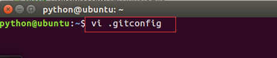
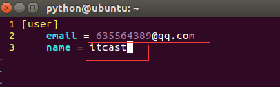
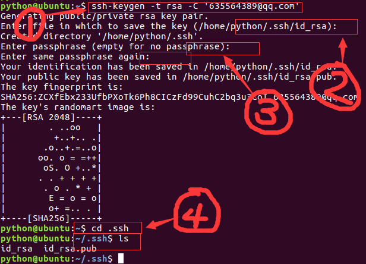
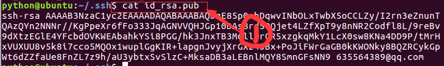

# 08 Git

## Git简介

- Git是目前世界上最先进的分布式版本控制系统
- Linus在1991年创建了开源的Linux，从此，Linux系统不断发展，已经成为最大的服务器系统软件了。Linus虽然创建了Linux，但Linux的壮大是靠全世界热心的志愿者参与的，这么多人在世界各地为Linux编写代码，那Linux的代码是如何管理的呢？事实是，在2002年以前，世界各地的志愿者把源代码文件通过diff的方式发给Linus，然后由Linus本人通过手工方式合并代码！你也许会想，为什么Linus不把Linux代码放到版本控制系统里呢？不是有CVS、SVN这些免费的版本控制系统吗？因为Linus坚定地反对CVS和SVN，这些集中式的版本控制系统不但速度慢，而且必须联网才能使用。有一些商用的版本控制系统，虽然比CVS、SVN好用，但那是付费的，和Linux的开源精神不符。不过，到了2002年，Linux系统已经发展了十年了，代码库之大让Linus很难继续通过手工方式管理了，社区的弟兄们也对这种方式表达了强烈不满，于是Linus选择了一个商业的版本控制系统BitKeeper，BitKeeper的东家BitMover公司出于人道主义精神，授权Linux社区免费使用这个版本控制系统。安定团结的大好局面在2005年就被打破了，原因是Linux社区牛人聚集，不免沾染了一些梁山好汉的江湖习气。开发Samba的Andrew试图破解BitKeeper的协议（这么干的其实也不只他一个），被BitMover公司发现了（监控工作做得不错！），于是BitMover公司怒了，要收回Linux社区的免费使用权。Linus可以向BitMover公司道个歉，保证以后严格管教弟兄们，嗯，这是不可能的。实际情况是这样的：Linus花了两周时间自己用C写了一个分布式版本控制系统，这就是Git！一个月之内，Linux系统的源码已经由Git管理了！牛是怎么定义的呢？大家可以体会一下。Git迅速成为最流行的分布式版本控制系统，尤其是2008年，GitHub网站上线了，它为开源项目免费提供Git存储，无数开源项目开始迁移至GitHub，包括jQuery，PHP，Ruby等等。历史就是这么偶然，如果不是当年BitMover公司威胁Linux社区，可能现在我们就没有免费而超级好用的Git了。
- 总结git的两大特点：
  - 版本控制：可以解决多人同时开发的代码问题，也可以解决找回历史代码的问题
  - 分布式：Git是分布式版本控制系统，同一个Git仓库，可以分布到不同的机器上。首先找一台电脑充当服务器的角色，每天24小时开机，其他每个人都从这个“服务器”仓库克隆一份到自己的电脑上，并且各自把各自的提交推送到服务器仓库里，也从服务器仓库中拉取别人的提交。可以自己搭建这台服务器，也可以使用GitHub网站
- git中存储是变更信息，而不是整个文件
- 点击查看[git官方](https://git-scm.com/)
- 点击查看[github官方](https://github.com)
- 更多git命令参见[git教程](http://www.liaoxuefeng.com/wiki/0013739516305929606dd18361248578c67b8067c8c017b000)

### 安装与配置

- 当前ubuntu镜像中已经安装好了git，以下步骤可以跳过
- 安装

```bash
sudo apt-get install git
```

- 安装成功后，运行如下命令

```bash
git
```

### 使用github的流程

- 在实际项目开发中，按照如下步骤使用git进行代码管理
  - 1.项目经理在开发之初，创建好仓库，上传项目的框架、组员分支
  - 2.组员克隆项目框架，同步分支，按分工开发，在分支提交代码
  - 3.在需要发布时，项目经理将各分支合并到dev上，再合并到master上
- git将代码开发分成了工作区、暂存区、仓库区，为了能够交换代码还需要有服务器，一般使用github
- git四部分的交互方式如下图


## 创建

- 在项目开始阶段，需要由项目经理搭建项目框架，并上传到仓库
- 如下操作都由项目经理完成

### 创建仓库

- 注册github账户，登录后，点击"start a project"


- 在新页面中，输入项目的名称，勾选'readme.md'，点击'create repository'


- 添加成功后，转到文件列表页面，点击'create new file'创建新文件


- 填写文件名称为'.gitignore'，代码如下，表示项目中的pyc文件不需要被管理，因为这些文件代码是根据py生成的
- 详细的ignore文件可以参考[官方Python.gitignore文件](https://github.com/github/gitignore/blob/master/Python.gitignore)

```
*.pyc
```

- 点击'preview'查看预览，点击'create new file'完成创建


- 创建完成后，文件列表如下


### 添加ssh账户

- 如果某台机器需要与github上的仓库交互，那么就要把这台机器的ssh公钥添加到这个github账户上
- 点击账户头像后的下拉三角，选择'settings'


- 点击'SSH and GPG keys'，添加ssh公钥


- 在ubuntu的命令行中，修改某台机器的git配置


- 修改为注册github时的邮箱，填写用户名，要求组员的用户名不能重复


- 生成git密钥
- 公钥为id_rsa.pub
- 私钥为id_rsa

```bash
ssh-keygen -t rsa -C "邮箱地址"
```


- 查看公钥内容，复制此内容

```bash
cat id_rsa.pub
```


- 回到浏览器中，填写标题，粘贴公钥


- 公钥添加成功后，如下图


### 克隆项目

- 在浏览器中点击进入github首页，再进入项目仓库的页面


- 复制git地址


- 在命令行中复制仓库中的内容

```bash
git clone git地址
```


### 创建项目分支

- 每个员工开发期的代码互不干扰，并行开发，则每人使用一条分支
- 项目开发中公用分支包括master、dev
  - 分支master用于发布，默认分支，当需要发布时将dev分支合并
  - 分支dev开发阶段性的代码合并，每个阶段的工作完成后需要进行一次，控制项目的进度
  - 成员分支用于每个项目成员的代码开发，实现不交叉
- 创建分支

```bash
git branch 分支名称
例：
git branch dev
```

- 切换分支

```bash
git checkout 分支名称
例：
git checkout dev
```

- 将本地分支跟踪服务器分支

```bash
git branch --set-upstream-to=origin/分支名称 分支名称
例：
git branch --set-upstream-to=origin/dev dev
```

- 创建并切换分支

```bash
git checkout -b 分支名称
例：
git checkout -b itcast
```

- 查看所有分支，当前分支前标记为星*

```bash
git branch
```


- 删除分支

```bash
git branch -d 分支名称
没有例子，没错，就是没有例子，如果你删除了，我也找不回来哟
```

### 搭建项目框架

- 当前项目分支一共有3个，分别为master、dev、itcast，当前在itcast分支上工作
- 在克隆的目录下创建项目，使用django框架


- 将文件代码添加到暂存区

```bash
git add dailyfresh/
```

- 将暂存区提交到仓储区

```bash
git commit -m '搭建框架'
```

- 以上两步运行效果如下图


### 上传分支

- 当从远程仓库克隆时，实际上Git自动把本地的master分支和远程的master分支对应起来
- 远程仓库的默认名称是origin
- 推送前github上文件列表如下图


- 推送前github上分支列表如下图


- 推送分支，就是把该分支上的所有本地提交推送到远程库，推送时要指定本地分支，这样，Git就会把该分支推送到远程库对应的远程分支上

```bash
git push origin 分支名称
例：
git push origin dev
```

- 执行命令后提示如下


- 因为dev分支中没有文件操作，所以文件列表不变，但是分支列表增加了一项
- 点击垃圾桶可以删除指定分支，但是不要删


- 当前文件在itcast分支上，所以推送itcast分支

```bash
git push origin itcast
```

- 执行命令后提示如下


- 推送后github上文件列表如下图，注意在红线1处选择itcast分支


- 推送后github上分支列表如下图，在上图中点击红线2处


- 将itcast分支合并到dev分支

```bash
git checkout dev
git merge itcast
```


- 推送dev分支

```bash
git push origin dev
```

- 将dev分支合并到master分支

```bash
git checkout master
git merge dev
```


- 推送master分支

```bash
git push origin master
```

- 推送命令执行后如下图


- 在浏览器查看master分支的文件列表如下


## 开发

- 项目经理创建完成仓库后，接下来项目组成员就要进行开发工作了
- 以下操作由每个组员独自完成

### 添加ssh账户

- 这一步是组员在ubuntu中生成ssh密钥，然后交给项目经理添加到github中
- 在ubuntu的命令行中，修改某台机器的git配置



- 修改为注册github时的邮箱，填写用户名，要求组员的用户名不能重复



- 生成git密钥
- 公钥为id_rsa.pub
- 私钥为id_rsa

```bash
ssh-keygen -t rsa -C "邮箱地址"
```



- 查看公钥内容，复制此内容

```bash
cat id_rsa.pub
```



- 将复制的公钥发给项目经理，等项目经理在github上添加后，会将项目地址下发，然后就可以参与到项目开发中进行后续操作

### 本地克隆

- 根据项目经理提供的地址，如“git@github.com:bossliu2016/django1.git”，从github上将项目克隆到本地，默认对应的是master分支

```bash
git clone 项目地址
例：
git clone git@github.com:bossliu2016/django1.git
```

- 克隆后如下图


- 在克隆出来的目录下，隐藏目录.git存储了服务器、分支、文件变更等信息

### 同步分支

- 以自己的姓名创建分支，如果此分支已经存在可以添加数字后缀，具体要与项目经理商量

```bash
git checkout -b zhujiao
```

- 将本地分支推送到服务器

```bash
git push origin zhujiao
```

- 将本地分支跟踪服务器分支

```bash
git branch --set-upstream-to=origin/分支名称 分支名称
例：
git branch --set-upstream-to=origin/zhujiao zhujiao
```

- 将github上的dev分支同步到本地，因为开发过程中，所有组员都向这个分支上提交阶段性代码，并从这个分支获取最新代码

```bash
git checkout -b dev origin/dev
```

- 效果如下图


### 开发管理

- 上面的操作，只有我们在加入项目的第一天需要进行，只操作一次就够了
- 接下来的操作，是我们每天开发中都要进行的操作，这是必须做到熟练操作的命令
- 当前用户以zhujiao分支进行开发

```bash
git checkout zhujiao
```

- 本地仓库分为三部分：工作区，暂存区，仓库区，其中暂存区、仓库区是版本库部分
- 使用IDE如sublime、pycharm等打开项目目录

### 工作区与暂存区

- 对于添加、修改、删除文件的操作，都发生在工作区中
- 暂存区指将工作区中的操作完成小阶段的存储，是版本库的一部分
- 工作区与暂存区交互的方式及命令如下


#### 添加

- 按照工作分配，需要创建df_user模块，此时文件位于工作区

```bash
python manage.py startapp df_user
```

- 在ide中编辑df_user/models.py文件，创建模型类UserInfo

```python
class UserInfo(models.Model):
    uname = models.CharField(max_length=20)
    upwd = models.CharField(max_length=40)
    def __str__(self):
        return "%d" % self.pk
```

- 将目录df_user及所有子目录和文件添加到暂存区

```bash
git add 文件1 文件2 ...
git add 目录
例：
git add df_user/
```

#### 撤销

- 使用暂时区的内容恢复工作区的内容，放弃工作区的更改
- 在ide中编辑df_user/models.py文件，删除掉str方法

```python
class UserInfo(models.Model):
    uname = models.CharField(max_length=20)
    upwd = models.CharField(max_length=40)
```

- 此时无str方法的类在工作区，暂存区中的类是有str方法的，如果想回到暂存区的状态，则

```bash
git checkout -- 文件名
例：
git checkout -- df_user/models.py
```

- 在ide中查看df_user/models.py文件，发现str方法又回来了

### 暂存区与仓库区

- 仓库区表示个人开发的一个小阶段的完成，仓库区中记录的各版本是可以查看并回退的，但是在暂存区的版本一旦提交就再也没有了
- 暂存区与仓库区交互的方式及命令如下


- 查看暂存区未提交的记录

```bash
git status
```


- 将暂存区的记录提交到仓库区

```bash
git commit -m '本次提交的说明信息'
例：
git commit -m '创建df_user模块'
```


### 历史

- 查看仓库区的历史操作

```bash
git reflog
```


- 历史版本的名称：在Git中，用HEAD表示当前版本，也就是最新的提交00c6c39，上一个版本就是HEAD^，再上一个版本就是HEAD^^，当然往上100个版本写100个^肯定就麻烦了，提供了一种简写方式为HEAD~100

#### 对比

- 在ide中编辑df_user/models.py文件，删除str方法

```python
from django.db import models

class UserInfo(models.Model):
    uname = models.CharField(max_length=20)
    upwd = models.CharField(max_length=40)
```

- 对比工作区和仓库区中某版本某文件的不同

```bash
git diff HEAD -- 文件名
例：
git diff HEAD -- df_user/models.py
```


- 将上面的代码添加提交

```bash
git add df_user/models.py
git commit -m '删除模型类的str方法'
```

- 在ide中编辑df_user/models.py文件，修改str方法

```python
from django.db import models

class UserInfo(models.Model):
    uname = models.CharField(max_length=20)
    upwd = models.CharField(max_length=40)
    def __str__(self):
        return "%s" % self.uname
```

- 将上面的代码添加提交

```bash
git add df_user/models.py
git commit -m '修改模型类的str方法为name属性'
```

- 对比工作区和仓库区中某版本某文件的不同

```bash
git diff HEAD HEAD^^  -- df_user/models.py
```


#### 回退

- 回退历史版本到暂存区
- 将df_user/models.py文件的更改完成添加、提交

```bash
git add df_user/models.py
git commit -m '修改模型类'
```

- 查看当前的暂存区状态

```bash
git status
```


- 现在，没有str方法的是当前版本为HEAD，有str方法的版本为HEAD^，将有str方法的代码恢复到暂存区

```bash
git reset HEAD^或版本号
例：
git reset HEAD^
```


- 再次查看当前的暂存区状态

```bash
git status
```


- 可以再将暂存区的内容恢复到工作区

```bash
git checkout -- df_user/models.py
```

- 在ide中查看df_user/models.py文件，发现有str方法

### 删除

- 在ide中将文件删除
- 从工作区到暂存区提交

```bash
git rm 文件名
```

- 从暂存区到仓库区提交

```bash
git commit -m '说明信息'
```

- 示例如下
- 在模块df_user下添加文件a.py，编写代码如下

```python
if __name__=='__main__':
        print 'test a'
```

- 将df_user/a.py的变更添加到暂存区，再提交到仓库区

```bash
git add df_user/a.py
git commit -m '创建文件a'
```

- 在ide中将df_user/a.py文件删除，然后在暂存区删除

```bash
git rm df_user/a.py
```


- 提交暂存区的记录到仓库区

```bash
git commit -m '删除文件a'
```


- 提示：删除的文件一样可以恢复，只需要先从仓库区到暂存区，再从暂存区到工作区

### 本地与服务器

- 本地与服务器交互的方式及命令如下


- 推送指将特定分支在本地仓库区的记录发送到服务器上
- 获取指将服务器特定分支向本地工作区同步

#### 获取

- 建议：在每天开始编写代码前，先与服务器同步一次；或者在公用分支如dev上开发时，建议先同步后开发
- 什么时候会用到dev分支呢？答：合并阶段代码到dev分支，编辑公用文件如dailyfresh/urls.py
- 1.切换到dev分支

```bash
git checkout dev
```

- 2.获取代码，如果dev分支上有更新的记录则会同步到本地

```bash
git pull
```

- 3.切换回自己的分支继续开发

```bash
git checkout zhujiao
```

#### 推送

- 建议：在每天下班前将当天开发推送到服务器，这样可以在服务器中存储一个备份，即使本机出问题，在服务器上还能存在代码备份
- 注意：只会将仓库区的记录提交到服务器的对应分支下
- 推送前要将此分支跟踪服务器上的同名分支，推荐在创建分支时就完成跟踪
- 如果要推送自己分支以外的分支，需要先获取，再解决冲突，然后再推送

```bash
git push origin zhujiao
```

#### 合并分支

- 一个功能模块开发完了，合并到dev分支
- 1.切换到dev分支

```bash
git checkout dev
```

- 2.获取代码，如果dev分支上有更新的记录则会同步到本地

```bash
git pull
```

- 3.合并

```bash
git merge zhujiao
```

- 4.添加、提交并推送

```bash
git push origin dev
```

- 5.切换回工作分支

```bash
git checkout zhujiao
```

- 6.在最新代码上继续开发，所以将dev分支合并到zhujiao分支

```bash
git merge dev
```

#### 解决冲突

- 建议：在更改公用文件如dailyfresh/urls.py时需要操作dev分支，因为大家都可以操作dev分支，所以在合并时可能出现冲突
- 冲突的示例如下，修改dailyfresh/urls.py文件

##### 项目经理的操作

- 1.项目经理负责前台的开发，需要修改dailyfresh/urls.py文件

```bash
git checkout dev
```

- 2.在dailyfresh/urls.py文件中添加一条url

```python
from django.conf.urls import include, url
from django.contrib import admin

urlpatterns = [
    url(r'^admin/', include(admin.site.urls)),
    url(r'^',include('df_goods.urls')),
]
```

- 3.添加并提交

```bash
git add dailyfresh/urls.py
git commit -m '配置前台url'
```

- 4.同步到服务器

```bash
git push origin dev
```

##### 员工助教的操作

- 1.员工助教负责用户模块的开发，需要修改dailyfresh/urls.py文件

```bash
git checkout dev
```

- 2.在dailyfresh/urls.py文件中添加一条url

```python
from django.conf.urls import include, url
from django.contrib import admin

urlpatterns = [
    url(r'^admin/', include(admin.site.urls)),
    url(r'^user/',include('df_user.urls')),
]
```

- 3.添加并提交

```bash
git add dailyfresh/urls.py
git commit -m '配置用户模块url'
```

- 4.向服务器推送

```bash
git push origin dev
```

- 5.推送时发现出错误了，错误信息如下图


- 根据提示，需要先获取服务器的变更

```bash
git pull
```

- 发现有冲突，而且自动合并冲突失败，需要手动合并冲突，指向dailyfresh/urls.py文件


- 当前dailyfresh/urls.py文件内容如下

```python
from django.conf.urls import include, url
from django.contrib import admin

urlpatterns = [
    url(r'^admin/', include(admin.site.urls)),
<<<<<<< HEAD
    url(r'^user/',include('df_user.urls')),
=======
        url(r'^',include('df_goods.urls')),
>>>>>>> ae79e1fd93d0d9e7f8ca36481c611a2b4a38a9db
]
```

- 其中，<<<<<<< HEAD表示当前版本的内容，=======后面，表示>>>>>>> ae79e1fd93d0d9e7f8ca36481c611a2b4a38a9db版本的内容，发现两句代码并不冲突，都需要保留，如果不能确定是否保留，可以与编写该语句的人员沟通，当前代码更改后如下

```python
from django.conf.urls import include, url
from django.contrib import admin

urlpatterns = [
    url(r'^admin/', include(admin.site.urls)),
    url(r'^user/',include('df_user.urls')),
    url(r'^',include('df_goods.urls')),
]
```

- 6.冲突解决完成，再次添加、提交、推送

```bash
git add dailyfresh/urls.py
git commit -m '配置用户模块url-解决冲突后'
git push origin dev
```

### Debug分支

- 在项目的正常开发过程中，之前发布过的版本可能很会出bug，这时就需要停下来现在的开发任务，先去修改bug，完成后再回来继续开发任务
- git中stash提供了保存现场的功能，可以把当前工作区、暂存区中的内容不需要提交而保存下来，转而去做bug修复，完成后再恢复现场，继续开发工作
- 示例如下：停止当前工作，修复master分支下的一个bug，为修改dailyfresh/settings.py文件
- 语言和时区的原内容为

```python
LANGUAGE_CODE = 'en-us'
TIME_ZONE = 'UTC'
```

- 将语言和时区改为

```python
LANGUAGE_CODE = 'zh-Hans'
TIME_ZONE = 'Shanghai/Asia'
```

- 1.查看当前状态

```bash
git status
```


- 2.保存现场

```bash
git stash
```


- 再查看当前状态，发现是干净的

```bash
git status
```


- 3.切换到master分支

```bash
git checkout master
```

- 4.新建临时分支用于修复bug，用完后会删除此分支

```
git checkout -b bug001
```

- 5.按照上面的设计，修改dailyfresh/settings.py文件的语言和时区如下
python
```
LANGUAGE_CODE = 'zh-Hans'
TIME_ZONE = 'Shanghai/Asia'
```

- 添加：将工作区中的更改添加到暂存区
- 注意：当前目录为manage.py文件所在目录

```bash
(py_django) python@ubuntu:~/Desktop/pytest/django1/dailyfresh$ git add dailyfresh/settings.py
```

- 提交：将暂存区的内容提交到仓库区

```bash
git commit -m '修复时区语言'
```

- 6.切换回master分支

```bash
git checkout master
```

- 7.将bug001分支合并到master分支
- 因为临时分支用完后会被删除，无法通过分支查询历史记录，所以使用临时分支时需要使用no-ff的方式，同时写上-m备注信息

```bash
git merge --no-ff -m "修复bug-语言时区" bug001
```


- 推送到服务器

```bash
git push
```

- 8.删除临时分支bug001

```bash
git branch -d bug001
```


- 9.切换回工作分支zhujiao

```bash
git checkout zhujiao
```

- 查看现场列表

```bash
git stash list
```


- 恢复现场

```bash
git stash pop
```


- 恢复现场后查看工作状态

```bash
git status
```


- 接下来可以在这个分支继续开发

### 发布

- 项目开发完一个版本后，需要进行项目的合并与发布
- 项目合并与发布，需要项目经理和组员一起来完成，每个人将开发的分支逐个合并到dev分支，如果有冲突则解决冲突，在dev上的代码经过测试没有问题后，则由经理合并到master分支，完成发布
- 实现发布主要遵守如下步骤：
  - 每个人逐个合并分支到dev
  - 经理合并dev到master并发布
  - 每个人获取最新的dev分支、master分支

#### 逐个合并

- 这一步是每个人将自己分支上开发的代码，合并到dev分支上，每个人逐个执行1-6步
- 前题：已经完成了自己分支代码的开发并完成添加、提交及推送
- 1.切换到dev分支

```bash
git checkout dev
```

- 2.获取最新记录代码

```bash
git pull
```

- 3.合并，将自己编写的代码加入进来，如果有冲突则与上一个组员商量解决冲突
- 如果没有冲突则可以跳过4、5步

```bash
git merge 分支
例：
git merge zhujiao
```

- 4.添加
- 注意：在项目的根级目录下，即README.md所在的目录下

```bash
git add ./
```


- 5.提交

```bash
git commit -m 'zhujiao发布v1.0'
```

- 6.推送

```bash
git push origin dev
```

#### 经理合并

- 所有成员都完成合并后，接下来是项目经理要执行的操作
- 1.切换到dev分支

```bash
git checkout dev
```

- 2.获取最新

```bash
git pull
```

- 3.切换到master分支

```bash
git checkout master
```

- 4.合并dev分支到master分支
- 如果有冲突，则找相应的组同解决冲突
- 如果没有冲突则可以跳过5、6步

```bash
git merge dev
```

- 5.添加
- 注意：在项目的根级目录下，即README.md所在的目录下

```bash
git add ./
```

- 6.提交

```bash
git commit -m '发布v1.0'
```

- 7.打标签
- 标签就是为了给一堆数字的版本号，起一个容易记住的名字，一般用于master分支

```bash
git tag v1.0
```

- 8.推送

```bash
git push
```

#### 逐个获取

- 现在最新的代码已经有了，接下来在这个版本代码基础上继续开发，每个人都要获取最新的代码
- 1.切换到master分支

```bash
git checkout master
```

- 2.获取

```bash
git pull
```

- 3.切换到dev分支

```bash
git checkout dev
```

- 4.将master分支合并到dev分支

```bash
git merge master
```

- 5.切换到自己工作的分支如zhujiao分支

```bash
git checkout zhujiao
```

- 6.将dev分支合并到工作分支如zhujiao分支

```bash
git merge dev
```

## 总结

- git命令
  - git clone git地址
  - git add 文件或目录
  - git rm 文件或目录
  - git checkout -- 文件
  - git commit -m '备注说明'
  - git reset HEAD或版本号
  - git reflog
  - git log
  - git status
  - git branch 分支名称
  - git branch --set-upstream-to=origin/分支名称 分支名称
  - git checkout 分支名称
  - git checkout -b 分支名称 origin/分支名称
  - git diff 版本1 版本2
  - git merge 分支名称
  - git pull
  - git push origin 分支名称
  - git tag 标签名称
  - git stash

## 作业

- 按组完成项目开发，并在最后一天的下午，完成项目路演